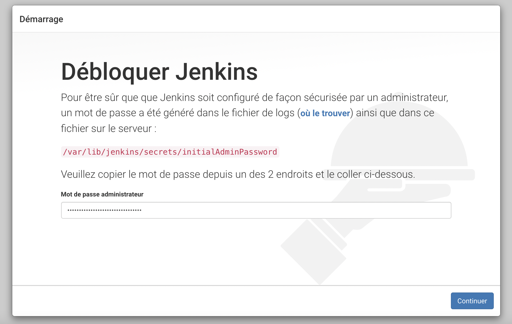

#  Devops Project 2 
## Objectif

Déploiement d'une application Node.js dans un pipeline Jenkins

# Introduction

# La Philosophie DevOps

Le DevOps offre un framework conçu pour dynamiser et améliorer le développement d'applications et accélérer la mise à disposition de nouvelles fonctionnalités, de mises à jour logicielles ou de produits.

Il favorise la communication, la collaboration, l'intégration, la visibilité et la transparence continues entre les équipes chargées du développement d'applications (Dev) et celles responsables des opérations IT (Ops).

Cette relation plus étroite entre Dev et Ops se reflète dans chaque phase du cycle de vie DevOps : planification logicielle initiale, codage, développement, test, publication, déploiement, opérations et surveillance continue. Elle génère de façon constante des retours clients, ce qui renforce le potentiel d'amélioration lors du développement, des tests et du déploiement. La publication accélérée et permanente des modifications ou ajouts de fonctionnalités en est un exemple.

Les objectifs du DevOps s'articulent autour de quatre catégories : culture, automatisation, mesure et partage. Dans chacun de ces domaines, les outils DevOps améliorent la rationalisation et la collaboration des workflows de développement et d'opérations en automatisant les tâches chronophages, manuelles ou statiques des phases d'intégration, de développement, de test, de déploiement ou de surveillance.

# Notre Pratiques du DevOps

Notre pratiques DevOps nous permet d'amélioré en continu en automatisent les processus sur plusieurs phases du cycle de développement :

* Développement continu. Cette pratique couvre les phases de planification et de codage dans le cycle de vie DevOps et peut inclure des mécanismes de contrôle des versions.

* Tests continus. Cette pratique prévoit des tests automatisés, planifiés et continus lors de l'écriture ou de la mise à jour du code de l'application qui accélèrent la livraison du code en production.

* Intégration continue. Cette pratique rassemble des outils de gestion de la configuration, de test et de développement pour assurer le suivi de la mise en production des différentes portions du code. Elle implique une collaboration étroite entre les équipes responsables des tests et du développement pour identifier et résoudre rapidement les problèmes de code.

* Livraison continue. Cette pratique automatise la publication des modifications du code après la phase de test, dans un environnement intermédiaire ou de préproduction. Un membre de l'équipe peut décider de publier ces modifications dans l'environnement de production.

* Déploiement continu. À l'instar de la livraison continue, cette pratique automatise la publication d'un code nouveau ou modifié dans l'environnement de production. Les entreprises peuvent être amenées à publier plusieurs fois par jour des modifications du code ou des fonctionnalités. Dans un contexte de déploiement continu, les technologies de conteneur comme Docker et Kubernetes assurent la cohérence du code entre plusieurs plateformes et environnements.

* Surveillance continue. Cette pratique prévoit une surveillance continue du code exécuté et de l'infrastructure sous-jacente. Les développeurs reçoivent des retours sur les bogues ou sur les problèmes.


## Nos outils DevOps

* Nous allons gérer le code source à l'aide de l'outil du système de contrôle de version Git.
* Automatisez le processus de création de code à l'aide d'outil CI Jenkins.
* Scannez le code pour détecter les failles avec Snyk.
* Créez une image et la déployez avec une technologie conteneurisée Docker.
* Faires évoluer l'application à l'aide de l'outil d'orchestration de conteneurs Kubernetes.

# Qu'est-ce que Terraform ? 
Terraform est l'offre d'infrastructure en tant que code de HashiCorp. C'est un outil pour construire, modifier et gérer l'infrastructure de manière sûre et reproductible. Les opérateurs et les équipes d'infrastructure peuvent utiliser Terraform pour gérer les environnements avec un langage de configuration appelé HashiCorp Configuration Language (HCL) pour des déploiements automatisés lisibles par l'homme.

# Jenkins 
Pipeline Jenkins  est un serveur d'automatisation autonome et open source utilisé pour automatiser les tâches associées à la création, aux tests et à la livraison/déploiement de logiciels. Jenkins Pipeline implémente des pipelines de livraison continue dans Jenkins grâce à l'utilisation de plugins et d'un fichier Jenkins. Le fichier Jenkins peut être déclaratif ou scripté et contient une liste d'étapes à suivre par le pipeline.

# Infrastructure en tant que code 

il s'agit du processus de gestion de l'infrastructure dans un ou plusieurs fichiers plutôt que de configurer manuellement les ressources dans une interface utilisateur. Une ressource dans cette instance est toute pièce d'infrastructure dans un environnement donné, telle qu'une machine virtuelle, un groupe de sécurité, une interface réseau, etc.

À un niveau élevé, Terraform permet aux opérateurs d'utiliser HCL pour créer des fichiers contenant les définitions de leurs ressources souhaitées sur presque tous les fournisseurs (AWS, GCP, GitHub, Docker, etc.) et automatise la création de ces ressources au moment de la candidature. 

Dans cette piste, nous couvrirons les fonctions de Terraform pour créer une infrastructure sur AWS.

# Le role des environnements


# Prérequis 

Compte GitHub 
Compte AWS
Installer Terraform
Installer docker
Installer Kubernetes
Utilisateur AWS avec des autorisations d'administrateur


# Architecture 

Dans ce projet, nous allons créer 4 instances AWS:

* Jenkins
* agent jenkins
* Pré-production
* Production
* S3 Bucket

Normalement, ce type d'architecture prendrait un certain temps à configurer dans la console AWS, mais grâce à Infrastructure as Code, le déploiement ne devrait prendre qu'environ 3 minutes après l'application du code Terraform.


# Aws
# Création d'une instance EC2 pour Jenkins:

* t2.large
* lancer docker compose
* SSD 20 Go
* Sécurity Group : 22 / 80 /  8080


# Instance Ec2 Jenkins
## Nom et ID de mon 

* Nom de mon instance Ec2 : `projetgrp3-ec2-jenkins`
* ID de mon instance Ec2 :	    ` i-04ce15266a590e510`
* IPv4 publique de mon instance Ec2 :	`54.174.144.82`

## Déverrouillage de Jenkins
http://54.174.144.82:8080/



```txt
L'assistant de configuration post-installation démarre.
Lorsque vous accédez pour la première fois à une nouvelle instance Jenkins, vous êtes invité à la déverrouiller à l'aide d'un mot de passe généré automatiquement. Accédez à http://54.174.144.82:8080 et attendez que la page Déverrouiller Jenkins apparaisse.

À partir de la sortie du journal de la console Jenkins, copiez le mot de passe alphanumérique généré automatiquement.
```

* La commande suivante imprimera le mot de passe sur la console:
```bash
=>sudo cat /var/lib/jenkins/secrets/initialAdminPassword
6384c868fe614bd3ac72b3495daf7ae3
```
Nom d'utilisateur:	Administrator
mdp:	Umanis-2022

on installe les plugins suggérés et on crée un utilisateur


# Backend
##  Créer un backend de compartiment S3 

C'est une bonne pratique de traiter notre fichier d'état comme un secret et de le stocker à distance. 

Cela ajoute une sécurité accrue, mais permet également la collaboration entre les membres de l'équipe. Si le fichier d'état est stocké localement sur notre ordinateur, notre équipe n'y a évidemment pas facilement accès. Une chose à garder à l'esprit est le verrouillage d'état. 

Nous voulons nous assurer que notre option backend verrouille notre état lorsque quelqu'un met en service des ressources. Si deux membres de l'équipe tentent d'apporter des modifications en même temps, le fichier d'état peut être corrompu. Nous disons cela parce que bien que la plupart des options backend le fassent automatiquement, S3 ne le fait pas. Pour ce projet, nous ne l'avons pas activé le verrouillage d'état car nous travaillons sur le projet en équipe et il n'y avait aucun risque que mes modifications entrent en collision avec quelqu'un d'autre. 

Si nous souhaitions ajouter un verrouillage d'état à notre backend S3, veuillez consulter cette documentation Terraform:

https://www.terraform.io/language/settings/backends/s3


Créez un compartiment S3 à l'aide sur l'AWS. Assurez-vous de créer un nom unique. 


### Liste des installations sur notre instance Jenkins:
* Java
* Docker
* Terraform
* Ansible

### Les commandes d'installation:
```sh
#install Jenkins
curl -fsSL https://pkg.jenkins.io/debian-stable/jenkins.io.key | sudo tee \
  /usr/share/keyrings/jenkins-keyring.asc > /dev/null
echo deb [signed-by=/usr/share/keyrings/jenkins-keyring.asc] \
  https://pkg.jenkins.io/debian-stable binary/ | sudo tee \
  /etc/apt/sources.list.d/jenkins.list > /dev/null
sudo apt-get update -y

#Installation of Java
sudo apt-get install -y jenkins
sudo apt install -y openjdk-11-jdk

#Start Jenkins
sudo systemctl daemon-reload
sudo systemctl start jenkins

#Install docker
curl -fsSL https://get.docker.com -o get-docker.sh
sh get-docker.sh
sudo usermod -aG docker ubuntu
sudo usermod -aG docker jenkins

#Install TERRAFORM
curl -fsSL https://apt.releases.hashicorp.com/gpg | sudo apt-key add -
sudo apt-add-repository "deb [arch=amd64] https://apt.releases.hashicorp.com $(lsb_release -cs) main"

# Install Minikube Ubuntu
sudo apt-get update && sudo apt-get install -y apt-transport-https
curl -s https://packages.cloud.google.com/apt/doc/apt-key.gpg | sudo apt-key add -
echo "deb https://apt.kubernetes.io/ kubernetes-xenial main" | sudo tee -a /etc/apt/sources.list.d/kubernetes.list
sudo apt-get update
sudo apt-get install -y kubectl
```

# Création d'un agent Jenkins #

Nous voulons créer un agent Jenkins en plus de l'agent master.

Ce nouvel agent s'occupera exclusivement de tout la partie consistant à construire l'image docker, la lancer, la scanner, la tester et la pousser sur Dockerhub. Une fois ces tâches effectuées l'agent effacera toutes les données qui lui ont été passées pour être de nouveau fraîchement disponible pour un future build.

## Création d'une machine pour l'agent test sur AWS ##

Pour cet agent nous voulons utiliser une machine AWS qui servira seulement d'hôte à l'agent Jenkins:
* t2.large
* SSD 20 Go
* Sécurity Group : 22 / 80 /  8080

Nous y installons seulement Docker dessus.

## Création de l'Agent-test ##

Commençons par créer cet `Agent-test` sur l'interface de Jenkins :

1. Administrer Jenkins **->** Gérer les noeuds **->** Créer un noeud:


2. Nous lui donnons le nom de `Agent-test` et nous le réservons pour les jobs qui lui sont associés.
On se connecte sur celui-ci en SSH en lui précisant l'hôte et les credentials.


## Utilisation de l'Agent-test ##

Il reste simplement à faire appel à cet agent dans le pipeline là ou on le souhaite :

```Groovy
stage ('Image Build (TEST)') {
    agent {label 'Agent-test'}
        steps{
             ...
        }
}
```

# Dockerfile

Notre Dockerfile est un document texte qui contient les instructions pour assembler une image Docker. Lorsque nous disons à Docker de construire notre image pour notre application en exécutant la commande docker build, Docker lit ces instructions, les exécute et crée une image Docker en conséquence. Par la suite notre image docker sera poussée sur le dépot dockerhub.

- FROM: 
Les images Docker peuvent être héritées d'autres images. Par conséquent, au lieu de créer notre propre image de base, nous utiliserons l'image officielle Node.js qui contient déjà tous les outils et packages dont nous avons besoin pour exécuter une application Node.js. 

- WORKDIR: 
Pour faciliter les choses lors de l'exécution du reste de nos commandes, créons un répertoire de travail. Cela indique à Docker d'utiliser ce chemin comme emplacement par défaut pour toutes les commandes suivantes. De cette façon, nous n'avons pas à saisir les chemins de fichiers complets, mais nous pouvons utiliser des chemins relatifs basés sur le répertoire de travail.

- COPY
Avant de pouvoir exécuter npm install, nous devons insérer nos fichiers package.json et package-lock.json dans notre images. Nous utilisons la commande COPY pour ce faire. La commande COPY prend deux paramètres : src et dest. 
Le premier paramètre src indique à Docker quels fichiers nous souhaitons copier dans l'image. Le deuxième paramètre dest indique à Docker où vous souhaitez copier ce ou ces fichiers. 

Nous allons copier le fichier package.json et le fichier package-lock.json dans notre répertoire de travail /usr/src/app.

- RUN 
La toute première chose à faire une fois que nous avons téléchargé un projet écrit en Node.js est d'installer les packages npm. Cela garantit que votre application a toutes ses dépendances installées dans le répertoire node_modules où le runtime Node pourra les trouver. 

Une fois que nous avons nos fichiers dans l'image, nous pouvons utiliser la commande RUN pour exécuter la commande npm install. Cela fonctionne exactement de la même manière que si nous exécutions npm install localement sur notre machine, mais cette fois, ces modules Node seront installés dans le répertoire node_modules à l'intérieur de notre image.

À ce stade, nous avons une image basée sur la version de nœud 14.16 et nous avons installé nos dépendances. 

- COPY . .
La prochaine chose que nous devons faire est d'ajouter notre code source dans l'image. Nous utiliserons la commande COPY comme nous l'avons fait avec nos fichiers package.json ci-dessus.

- EXPOSE : 
L'instruction EXPOSE informe Docker que le conteneur écoute sur les ports réseau '3000' lors de l'exécution. 

- COPY :
Maintenant, tout ce que nous avons à faire est de dire à Docker quelle commande nous voulons exécuter lorsque notre image est exécutée à l'intérieur d'un conteneur. Nous le faisons avec la commande CMD.

* lien :
https://github.com/projetajc-group3/docker_node.git

```ruby
FROM node:14.16
WORKDIR /usr/src/app
# Install app dependencies
# A wildcard is used to ensure both package.json AND package-lock.json are copied
# where available (npm@5+)
COPY package*.json ./

RUN npm install
# If you are building your code for production
# RUN npm ci --only=production
# Bundle app source
COPY . .
EXPOSE 3000
CMD [ "node", "./bin/www" ]
```

# Build de l'image #

Maintenant que nous avons créé notre Dockerfile, construisons notre image. Pour ce faire, nous utilisons la commande docker build. La commande docker build crée des images Docker à partir d'un Dockerfile. 

# Run # 

# Scan de sécurité et de vulnérabilité de l'application #

Avant de pousser notre application en pré-prod, nous lançons un scan du code applicatif à la recherche d'éventuelles vulnérabilités. Cela dans le but de renforcer la sécurité.
Pour ça, nous utilisons **Snyk**, qui à l'énorme avantage d'avoir un module sur Jenkins pour une meilleure intégration de l'outil directement au pipeline. 

Passons aux étapes d'installation et de configuration.

## Installation ##

Pour l'installation rien de plus simple. Snyk possède un module directement sur Jenkins avec toute la documentation à suivre : https://plugins.jenkins.io/snyk-security-scanner/.

1. Administrer Jenkins **->** Gestion des plugins **->** Disponibles **->** Recherche de "Snyk" **->** Installer
2. Administrer Jenkins **->** Configuration globale des outils **->** Installations Snyk


1. On ajoute le nom de notre installation, nous l'appelons **snyk@latest**, on laisse les autres options par défaut.


1. Création d'un compte utilisateur sur Snyk, nous prenons soin de copier la clé.


1. Administrer Jenkins **->** Manage Credentials **->** Global **->** Ajouter des identifiants **->** Type : Snyk API token
On copie ici notre clé et on lui donne un nom : **snyk-token**


L'installation et la configuration sont terminées. Passons à l'utilisation du module directement dans le pipeline.

## Utilisation dans le pipeline ##

```Groovy
stage('Scan code (TEST)') {
            agent { label 'Agent-test'}
            steps {
                echo 'Testing...'
                snykSecurity(
                    snykInstallation: 'snyk@latest',
                    snykTokenId: 'snyk-token',
                    targetFile: 'docker_node/package.json',
                )
            }
        }
```

Pour lancer un test sur le code du projet, nous avons simplement un stage dans le pipeline, que nous lançons sur l'Agent-test, créé précédemment. Nous devons fournir à Snyk le nom de notre installation Snyk et le nom du token Snyk.
Nous précisons aussi le **targetFile** qui pointe sur le manifest du projet. Dans notre cas, c'est le fichier `package.json`.

## Rapport Snyk ##

En lançant le pipeline sur Jenkins, nous remarquons que le stage "Scan code (TEST)" que nous venons d'ajouter est en échec.


Nous allons donc voir le détail du build. Sur la gauche, le menu "Snyk Security Report" est présent. En cliquant dessus nous avons le rapport suivant :


Il est clair que l'échec est dû à une vulnérabilité qui peut être corrigée simplement en utilisant une version plus à jour de la dépendance `ejs`.

Pour ça on met à jour le fichier `package.json`


On met également à jour le fichier `package-lock.json` :


Enfin, il reste à remplacer les fichiers présents dans `node_modules/ejs` par les fichiers de la version 3.1.6.

Une fois modifié avec la valeur recommandée par Snyk, nous relançons le pipeline. Et comme attendu, cette fois Snyk n'arrête pas le pipeline, et le rapport est vide !


> Note: Nous nous sommes permis de corriger cette erreur pour des raisons de démonstrations du module Snyk. En production réelle la bonne méthode serait plutôt de prévenir l'équipe de développement du problème.

# Test de fonctionnement de l'application #

Nous avons conteneurisé notre application, nous avons construit l'image, nous l'avons lancé et nous avons même testé le code sur d'éventuelles vulnérabilités. L'étape suivante est simplement de tester si l'application est bien déployée sur l'Agent-test.

Nous savons que notre application est un site internet écrit en Javacript. A l'intérieur du fichier `/views/index.ejs`, nous avons le titre du site qui est **Devops Foundation**.

Le test le plus simple est de faire un stage dans le pipeline qui fera un `curl` sur le titre du site :

```Groovy
stage ('Test curl (TEST)') {
            agent {label 'Agent-test'}
            steps{
                script{
                   sh '''
                       curl http://localhost/ | tac | tac | grep -iq "DevOps Foundation"
                   '''
                }
            }
        }
```
Si le curl réussi alors c'est que le site internet a bien été déployé.
>Note: nous faisons ici deux **tac** en commandes pour laisser le temps au curl de se finir.

# Push vers DockerHub #

# Création des machines Staging et Production avec Terraform #

# Déploiement en Staging avec Ansible #

# Kubernetes (minikube)

## Pourquoi Kubernetes ?
Avec Docker, nous disposons de commandes simples comme docker run ou docker stop pour démarrer/arrêter un conteneur . 

Contrairement à ces commandes simples qui nous permettent d'effectuer des opérations sur un seul conteneur, il n'y a pas de commande docker deploy pour pousser de nouvelles images vers un groupe d'hôtes.

De nombreux outils sont apparus ces derniers temps pour résoudre ce problème « d'orchestration de conteneurs » ; les plus populaires étant Docker Swarm (qui fait maintenant partie du moteur Docker) et Kubernetes. 

Tous viennent avec leurs avantages et leurs inconvénients mais, Kubernetes prend une avance considérable en termes d'utilisation et de fonctionnalités.

Kubernetes (également appelé «k8») fournit de puissantes abstractions qui dissocient complètement les opérations d'application telles que les déploiements et la mise à l'échelle des opérations d'infrastructure sous-jacentes. 

Ainsi, avec Kubernetes, vous ne travaillez pas avec des hôtes ou des machines virtuelles individuels sur lesquels exécuter votre code, mais plutôt Kubernetes voit l'infrastructure sous-jacente comme une mer de calcul sur laquelle placer des conteneurs.

## Concepts Kubernetes
Kubernetes a une architecture client/serveur. Le serveur Kubernetes s'exécute sur notre cluster (un d'hôte) sur lequel nous allons déployer notre application. Et nous interagissons  avec le cluster à l'aide du client kubectl.

- Pods
Un pod est l'unité de base dont traite Kubernetes, un groupe de conteneurs. S'il y a deux ou plusieurs conteneurs qui doivent toujours fonctionner ensemble et doivent être sur la même machine, faites-en un pod.

- Nœud
Un nœud est une machine physique ou virtuelle, exécutant Kubernetes, sur laquelle des pods peuvent être programmés.

- Label
Une étiquette est une paire clé/valeur utilisée pour identifier une ressource. Vous pouvez étiqueter tous vos pods servant le trafic de production avec "role=production", par exemple.

- Selector
Les sélections vous permettent de rechercher/filtrer des ressources par étiquettes. Suite à l'exemple précédent, pour obtenir tous les pods de production, votre sélecteur serait "role=production".

- Service
Un service définit un ensemble de pods (généralement sélectionnés par un "sélecteur") et un moyen d'y accéder, comme une adresse IP stable unique et le nom DNS correspondant.

## Gestion Réseau

### Nodeport

Un service NodePort est le moyen le plus simple d’aiguiller du trafic externe directement vers un Pod. NodePort, comme son nom l’indique, ouvre un port spécifique sur tous les Nœuds (les VMs), et tout trafic envoyé vers ce port est transféré vers le service.

Nous allons crée un nouvel objet Service nommé "nodeport", qui cible le port TCP 3000 sur n'importe quel pod avec l'étiquette «app=nodeapp».

port : port du service
tareget port : port du pod a utiliser (doit correcpondre à l'application)
nodeport : port utilisavle depuis l'extrieur du cluster (un genre de routeur)

```yaml
apiVersion: v1
kind: Service
metadata:
  name: nodeport
spec:
  type: NodePort
  selector:
    app: nodeapp
  ports:
      #port du pod a utiliser
    - targetPort: {{ containers_port }}
      #port du service
      port: {{ containers_port }}
      #port utilisable depuis l'extrieur du cluster
      nodePort: {{ external_port }}
```


## Objectifs
```Txt
• Nous allons créer un deployment avec 02 replicas de notre application node app
• Créez un service de type "nodeport" pour exposer notre deployement précédemment crées
• Activer l’ingress controller dans notre cluster minikube
```
# Déploiement dans Kubernetes

## Définir le fichier YAML pour le déploiement dans le cluster Kubernetes
YAML est un langage de balisage extensible lisible par l'homme. Il est utilisé dans Kubernetes pour créer un objet de manière déclarative.


=> vi nodeapp.yml

```yaml
apiVersion: v1
kind: Service
metadata:
  name: nodeport
spec:
  type: NodePort
  selector:
    app: nodeapp
  ports:
      #port du pod a utiliser 3000
    - targetPort: {{ containers_port }}
      #port du service 3000
      port: {{ containers_port }}
      #port utilisable depuis l'extrieur du cluster 30001
      nodePort: {{ external_port }}

---
apiVersion: apps/v1
kind: Deployment
metadata:
  name: nodeapp
  labels:
    app: nodeapp
spec:
  replicas: 2
  selector:
    matchLabels:
      app: nodeapp
  template:
    metadata:
      labels:
        app: nodeapp
    spec:
      containers:
          #webapp
        - name: {{ name_containers }}
          # projetajcgroup3/node:1.0
          image: {{ image_containers }}
          #port du conteneur 3000
          ports:
            - containerPort: {{ containers_port }}
```
# Répartition de notre fichier YAML

- apiVersion: 
La version de l'API que vous utilisez pour créer cet objet, c'est-à-dire le déploiement - nous utilisons apps/v1 

- kind: 
Quel type d'objet créez. Dans notre cas, c'est le déploiement. 

- metadata: 
Les métadonnées sont utilisées pour organiser l'objet. Le nom de notre déploiement est "nodeapp" 

- spec: 
est utilisé pour définir la spécification de l'objet. 

- replicas: 
Combien de pods vous souhaitez déployer dans le cluster sous ce déploiement. 

- template: 
matchLabels nous souhaitons déployer deux pods exécutant des conteneurs à partir de notre image "nodeapp"

- Le modèle est utilisé pour définir comment faire tourner le nouveau pod et la spécification du pod. 

- metadata: 
Métadonnées du pod nouvellement créé avec ce déploiement 

- labels:
Nous avons une étiquette - la clé est app et la valeur est nodeapp 

- spec:Spécifications des conteneurs 

- name:
Nom du conteneur 

- image
L'image qui peut être utilisée par le conteneur 


###################################
apiVersion: v1
kind: Service
metadata:
  name: nodeport
spec:
  type: NodePort
  selector:
    app: nodeapp
  ports:
  #port du pod a utiliser
    - targetPort: 3000
    #port du service
      port: 3000
      #port utilisable depuis l'extrieur du cluster
      nodePort: 30001

---
apiVersion: apps/v1
kind: Deployment
metadata:
  name: nodeapp
  labels:
    app: nodeapp
spec:
  replicas: 2
  selector:
    matchLabels:
      app: nodeapp
  template:
    metadata:
      labels:
        app: nodeapp
    spec:
      containers:
      - env:

        
      - name: webappprod
        image: projetajcgroup3/node:1.0
        ports:
        - containerPort: 3000
########################################
# Déploiement dans Kubernetes

## Définir le fichier YAML pour le déploiement dans le cluster Kubernetes
YAML est un langage de balisage extensible lisible par l'homme. Il est utilisé dans Kubernetes pour créer un objet de manière déclarative.


=> vi nodeapp.yml
```yaml
apiVersion: v1
kind: Service
metadata:
  name: nodeport
spec:
  type: NodePort
  selector:
    app: nodeapp
  ports:
  #port du pod a utiliser
    - targetPort: 3000
    #port du service
      port: 3000
      #port utilisable depuis l'extrieur du cluster
      nodePort: 30001

---
apiVersion: apps/v1
kind: Deployment
metadata:
  name: nodeapp
  labels:
    app: nodeapp
spec:
  replicas: 2
  selector:
    matchLabels:
      app: nodeapp
  template:
    metadata:
      labels:
        app: nodeapp
    spec:
      containers:
      - name: {{ name_containers }}
        image: {{ image_containers }}
        ports:
        - containerPort: 3000
```
# Répartition de notre fichier YAML

- apiVersion: 
La version de l'API que vous utilisez pour créer cet objet, c'est-à-dire le déploiement - nous utilisons apps/v1 

- kind: 
Quel type d'objet créez. Dans notre cas, c'est le déploiement. 

- metadata: 
Les métadonnées sont utilisées pour organiser l'objet. Le nom de notre déploiement est nodejs-deployment 

- spec: 
est utilisé pour définir la spécification de l'objet. 

- replicas: 
Combien de pods vous souhaitez déployer dans le cluster sous ce déploiement. 

- template: 
matchLabels nous souhaitons déployer deux pods exécutant des conteneurs à partir de notre image "nodeapp"

- Le modèle est utilisé pour définir comment faire tourner le nouveau pod et la spécification du pod. 

- metadata: 
Métadonnées du pod nouvellement créé avec ce déploiement 

- labels:
Nous avons une étiquette - la clé est app et la valeur est nodeapp 

- spec:Spécifications des conteneurs 

- name:
Nom du conteneur 

- image
L'image qui peut être utilisée par le conteneur 

Quelle option de port utiliser Nous utilisons containerPort 3000

Comme nous avons créé le fichier YAML, nous pouvons continuer et créer un déploiement à partir de ce fichier YAML.

# Ansible

Ansible va nous permetre de déployer rapidement et facilement nos applications tel que Kubernetes dans notre environement de production. Nous n'aurons pas besoin d'écrire du code pour automatiser notre installations. Nous allons listez les tâches à effectuer en écrivant un playbook, et Ansible trouvera comment amener vos systèmes à l'état dans lequel nous voulons qu'ils soient. 

En d'autres termes, nous n'aurons pas à configurer manuellement l'applications sur notre enviroenemt de production que nous avons crée à l'aide de terraform. Lorsque nous exécuterons notre playbook à partir de notre serveur Jenkins depuis le Jenkinsfile, Ansible utilisera le protocole SSH pour communiquer avec notre hôte distant de production et exécuter toutes les tâches (Tasks).

# Comment fonctionne Ansible
Dans Ansible, il existe deux catégories d'ordinateurs: le nœud maître (master) et les nœuds esclaves (slaves). 

Dans notre cas le nœud maître est une instance Ec2 sur laquel est installé jenkin ansi que l'outil Ansible. Notre instance Jenkins fait appel à l'outil Ansible afin d'éxécuter différentes tache depuis le jenkinsfile.

Ansible fonctionne en se connectant à des nœuds en SSH et en y poussant de petits programmes, appelés modules. Ces modules sont définis dans un fichier nommé le Playbook. Dans notre cas, voici la liste des modules utilisés:

- shell
- command
- template

Nous avons créé un template de fichier qui contient un manifest détaillant le deploiement de notre application Node, il sera déployé sur l'instance de production à l’aide du module template, qui prend en charge le transfert d’un fichier local du nœud de contrôle vers l'hôte géré. Le template contient les instructions de base qui seront ensuite recopié. Il contient également des variables qui seront remplacées individuellement sur la machine cible.

Le nœud maître, se base sur un fichier d'inventaire qui fournit la liste des hôtes sur lesquels les modules Ansible doivent être exécutés.

Ansible exécute ces modules en SSH et les supprime une fois terminé. La seule condition requise pour cette interaction est que votre nœud maître Ansible dispose d'un accès de connexion aux nœuds esclaves. Les clés SSH sont le moyen le plus courant de fournir un accès.

Dans notre cas Ansible et ça commande ansible-plyabook est appelé depuis notre jenkinsfile avec les commandes suivantes:

```yaml
git clone https://github.com/projetajc-group3/docker_role_deploy.git
ansible-galaxy install -r docker_role_deploy/roles/requirements.yml
ansible-playbook -i docker_role_deploy/hosts.yml docker_role_deploy/docker.yml
git clone https://github.com/projetajc-group3/kubernetes_role_deploy.git
ansible-galaxy install -r kubernetes_role_deploy/roles/requirements.yml
ansible-playbook -i kubernetes_role_deploy/hosts.yml kubernetes_role_deploy/kubernetes.yml
```


## Role Ansible

La configuration manuelle de notre cluster Kubernetes sur notre instance Ec2 est une tâche fastidieuse et prendrai également beaucoup de temps. Et aujourd'hui, avec la philosophie devops et l'automatisation, nous avons automatiser cette tâche. Dans le cadre de notre projet nous allons utiliser Ansible Role pour automatiser la configuration du cluster Kubernetes sur l'instance AWS EC2 de production.

### Définition du role

Les rôles sont une caractéristique robuste d'Ansible qui facilitent la réutilisation, de notre application Node's et simplifient l'écriture de notre Playbooks complexes en le divisant logiquement en composants réutilisables et en profiter par la même occasion pour le rendre plus facile à lire.

Il est possible de comparer les rôles Ansible aux librairies dans les langages de programmation. En effet, en programmation les librairies contiennent leurs propres variables et fonctions que vous pouvez réutiliser pour vos différents projets de programmation. C'est le cas aussi pour les rôles, qui possèdent leurs propres tâches, variables.

Nos rôle sont essentiellement limité à des fonctionnalités particulières:


- installation de Docker
- installation de Kubernetes


kubernetes_role_deploy/kubernetes.yml

```yaml
- name: deploy kubernetes using a role
  hosts: localhost
  become: true
  roles:
    - kubernetes_role
```

### Manifeste d'installation de Kubernetes

kubernetes_role/tasks/main.yml

```yaml
---
# tasks file for install kubernetes
- name: install tools 
  shell: |
    sudo apt-get -y update
    sudo apt install -y qemu qemu-kvm libvirt-daemon libvirt-clients bridge-utils virt-manager
    sudo apt-get install -y socat
    sudo apt-get install -y conntrack
    sudo apt-get -y install wget
- name: "Kubernetes bin"
  shell: |
    sudo wget https://storage.googleapis.com/minikube/releases/latest/minikube-linux-amd64
    sudo chmod +x minikube-linux-amd64
    sudo mv minikube-linux-amd64 /usr/bin/minikube
- name: "Kubernetes ctl"
  shell: |
    sudo curl -LO https://storage.googleapis.com/kubernetes-release/release/`curl -s https://storage.googleapis.com/kubernetes-release/release/stable.txt`/bin/linux/amd64/kubectl
    sudo chmod +x kubectl
    sudo mv kubectl  /usr/bin/
    sudo echo '1' > /proc/sys/net/bridge/bridge-nf-call-iptables
    sudo systemctl enable docker.service
- name: "Kubernetes launch"
  command: "minikube start --driver=none"

- name: "Create Manifests Kubernetes template" 
  template:
    src: "nodeapp.yml.j2"
    dest: "/home/ubuntu/nodeapp.yml"
  
- name: "Deploy Manifests Kubernetes"
  command: "kubectl apply -f nodeapp.yml"
  args:
    chdir: "/home/ubuntu/"
```

Ce manifestes contient les différentes instruction afin d'installer kubernetes à l'aide de différentes taches.


Ces différents repertoire dans git seront utilisé afin de créer notre role

Comme nous avons créé le fichier YAML, nous pouvons continuer et créer un déploiement à partir de ce fichier YAML. Pour cela en nous pouvons utiliser la commande suivante. 

kubectl create -f deploy.yaml


# Pre-requis

# install kubernetes avec Ansible

```ruby
- name: install tools 
  shell: |
    sudo apt-get -y update
    sudo apt install -y qemu qemu-kvm libvirt-daemon libvirt-clients bridge-utils virt-manager
    sudo apt-get install -y socat
    sudo apt-get install -y conntrack
    sudo apt-get -y install wget
- name: "Kubernetes bin"
  shell: |
    sudo wget https://storage.googleapis.com/minikube/releases/latest/minikube-linux-amd64
    sudo chmod +x minikube-linux-amd64
    sudo mv minikube-linux-amd64 /usr/bin/minikube
- name: "Kubernetes ctl"
  shell: |
    sudo curl -LO https://storage.googleapis.com/kubernetes-release/release/`curl -s https://storage.googleapis.com/kubernetes-release/release/stable.txt`/bin/linux/amd64/kubectl
    sudo chmod +x kubectl
    sudo mv kubectl  /usr/bin/
    sudo echo '1' > /proc/sys/net/bridge/bridge-nf-call-iptables
    sudo systemctl enable docker.service
- name: "Kubernetes launch"
  command: "minikube start --driver=none"

- name: "Create Manifests Kubernetes template" 
  template:
    src: "nodeapp.yml.j2"
    dest: "/home/ubuntu/nodeapp.yml"
  
- name: "Deploy Manifests Kubernetes"
  command: "kubectl apply -f nodeapp.yml"
  args:
    chdir: "/home/ubuntu/"
```

# Les commpandes de lancement

- minikube start --driver=none


- kubectl delete --all svc,deployments.apps,pod
- kubectl apply -f nodeapp.yml 
- kubectl describe services


- kubectl describe deployments.apps


- kubectl get pods
- kubectl get service
- kubectl get deployments.apps


ansible-playbook -i kubernetes_role_deploy/hosts.yml kubernetes_role_deploy/kubernetes.yml --extra-vars "name_containers=webappprod image_containers=projetajcgroup3/node:1.0" || true
