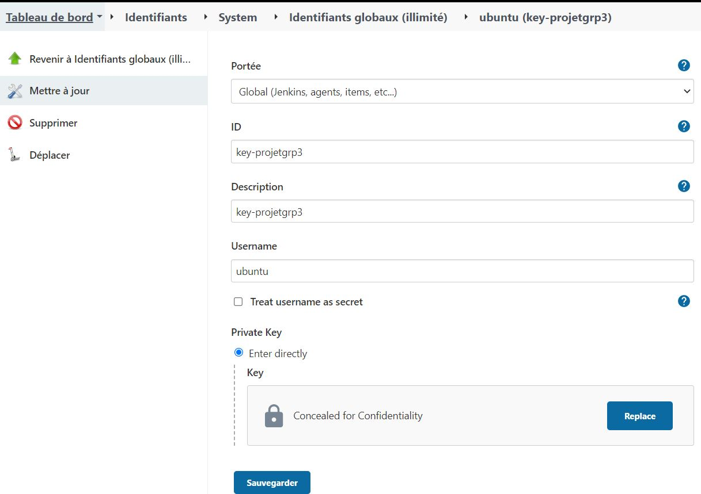
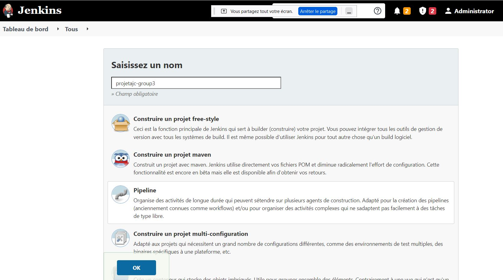
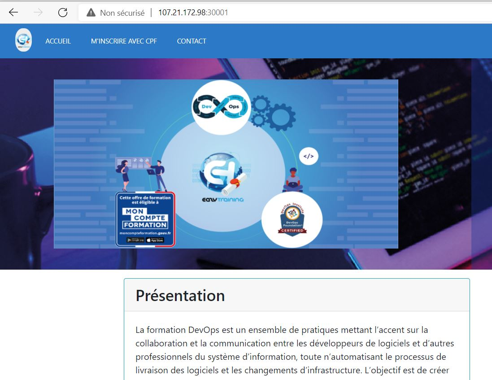
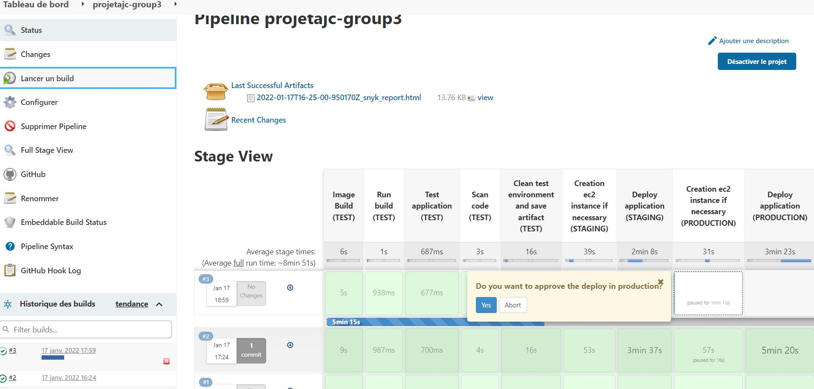
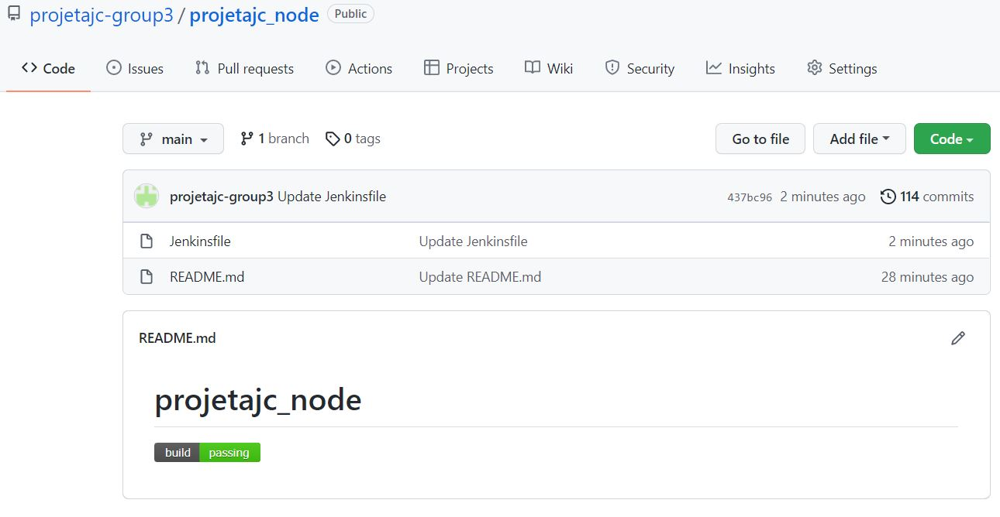

#  Devops Project 2 : CICD d'une Application node

* Objectif

Déploiement d'une application Node.js dans un pipeline Jenkins

* Equipe :
    - Abdelkader RAHMANI
    - Aurelien DAIX
    - Oussama ZAID 
    - Renaud SAUTOUR

# I- Introduction

## La Philosophie DevOps

Le DevOps offre un framework conçu pour dynamiser et améliorer le développement d'applications et accélérer la mise à disposition de nouvelles fonctionnalités, de mises à jour logicielles ou de produits.

Il favorise la communication, la collaboration, l'intégration, la visibilité et la transparence continues entre les équipes chargées du développement d'applications (Dev) et celles responsables des opérations IT (Ops).

Cette relation plus étroite entre Dev et Ops se reflète dans chaque phase du cycle de vie DevOps : planification logicielle initiale, codage, développement, test, publication, déploiement, opérations et surveillance continue. Elle génère de façon constante des retours clients, ce qui renforce le potentiel d'amélioration lors du développement, des tests et du déploiement. La publication accélérée et permanente des modifications ou ajouts de fonctionnalités en est un exemple.

Les objectifs du DevOps s'articulent autour de quatre catégories : culture, automatisation, mesure et partage. Dans chacun de ces domaines, les outils DevOps améliorent la rationalisation et la collaboration des workflows de développement et d'opérations en automatisant les tâches chronophages, manuelles ou statiques des phases d'intégration, de développement, de test, de déploiement ou de surveillance.

## Notre Pratiques du DevOps

Notre pratiques DevOps nous permet d'amélioré en continu en automatisent les processus sur plusieurs phases du cycle de développement :

* Développement continu. Cette pratique couvre les phases de planification et de codage dans le cycle de vie DevOps et peut inclure des mécanismes de contrôle des versions.

* Tests continus. Cette pratique prévoit des tests automatisés, planifiés et continus lors de l'écriture ou de la mise à jour du code de l'application qui accélèrent la livraison du code en production.

* Intégration continue. Cette pratique rassemble des outils de gestion de la configuration, de test et de développement pour assurer le suivi de la mise en production des différentes portions du code. Elle implique une collaboration étroite entre les équipes responsables des tests et du développement pour identifier et résoudre rapidement les problèmes de code.

* Livraison continue. Cette pratique automatise la publication des modifications du code après la phase de test, dans un environnement intermédiaire ou de préproduction. Un membre de l'équipe peut décider de publier ces modifications dans l'environnement de production.

* Déploiement continu. À l'instar de la livraison continue, cette pratique automatise la publication d'un code nouveau ou modifié dans l'environnement de production. Les entreprises peuvent être amenées à publier plusieurs fois par jour des modifications du code ou des fonctionnalités. Dans un contexte de déploiement continu, les technologies de conteneur comme Docker et Kubernetes assurent la cohérence du code entre plusieurs plateformes et environnements.

* Surveillance continue. Cette pratique prévoit une surveillance continue du code exécuté et de l'infrastructure sous-jacente. Les développeurs reçoivent des retours sur les bogues ou sur les problèmes.


## Nos outils DevOps

* Nous allons gérer le code source à l'aide de l'outil du système de contrôle de version Git.
* Automatisez le processus de création de code à l'aide d'outil CI Jenkins.
* Scannez le code pour détecter les failles avec Snyk.
* Créez une image et la déployez avec une technologie conteneurisée Docker.
* Faires évoluer l'application à l'aide de l'outil d'orchestration de conteneurs Kubernetes.

## Jenkins 
Pipeline Jenkins  est un serveur d'automatisation autonome et open source utilisé pour automatiser les tâches associées à la création, aux tests et à la livraison/déploiement de logiciels. Jenkins Pipeline implémente des pipelines de livraison continue dans Jenkins grâce à l'utilisation de plugins et d'un fichier Jenkins. Le fichier Jenkins peut être déclaratif ou scripté et contient une liste d'étapes à suivre par le pipeline.

## Infrastructure en tant que code 

il s'agit du processus de gestion de l'infrastructure dans un ou plusieurs fichiers plutôt que de configurer manuellement les ressources dans une interface utilisateur. Une ressource dans cette instance est toute pièce d'infrastructure dans un environnement donné, telle qu'une machine virtuelle, un groupe de sécurité, une interface réseau, etc.

À un niveau élevé, Terraform permet aux opérateurs d'utiliser HCL pour créer des fichiers contenant les définitions de leurs ressources souhaitées sur presque tous les fournisseurs (AWS, GCP, GitHub, Docker, etc.) et automatise la création de ces ressources au moment de la candidature. 

Dans cette piste, nous couvrirons les fonctions de Terraform pour créer une infrastructure sur AWS.


## II- Préparation du projet

### A- Prérequis 

* Compte GitHub (projetajc-group3)
* Compte DockerHub (projetajcgroup3)
* Compte Slack (projetajc.group3)
* Compte utilisateur AWS


### B- Création des serveurs pour Jenkins sur AWS 

Dans ce projet, nous allons créer 2 instances AWS pour Jenkins:

* Jenkins master: serveur qui pilotera l'ensemble du pipeline
* Jenkins agent: agent dédié au buid/scan/test du projet


&nbsp;&nbsp;&nbsp; 1- Création d'une instance ec2 pour Jenkins master

* t2.large
* SSD 20 Go
* Sécurity Group : 22 / 8080
* Key pair: key-projetgrp3.pem


Résultat:
* Nom de l'instance ec2 : `projetgrp3-ec2-jenkins`
* ID de mon instance ec2 : ` i-04ce15266a590e510`
* IPv4 publique de mon instance ec2 : `54.174.144.82`

&nbsp;&nbsp;&nbsp; 2- Création d'une instance ec2 pour Jenkins agent

De la même manière nous créons une instance ec2 avec les caractéristiques suivantes:
* t2.large
* SSD 20 Go
* Sécurity Group : 22 / 8080
* Key pair: key-projetgrp3.pem

Résultat:
* Nom de l'instance ec2 : `projetgrp3-ec2-jenkins-agent`
* ID de mon instance ec2 : ` i-01e49b48c289b3992`
* IPv4 publique de mon instance ec2 : `54.147.236.68`


### C- Installation de Jenkins 

&nbsp;&nbsp;&nbsp; 1- Commande de l'installation de java

```sh
sudo apt-get -y update
sudo apt-get -y install openjdk-11-jre-headless
sudo apt-get -y install default-jre
java -version
```

Résultat:
```sh
openjdk version "11.0.13" 2021-10-19
OpenJDK Runtime Environment (build 11.0.13+8-Ubuntu-0ubuntu1.20.04)
OpenJDK 64-Bit Server VM (build 11.0.13+8-Ubuntu-0ubuntu1.20.04, mixed mode)
```

&nbsp;&nbsp;&nbsp; 2- Commande de l'installation de jenkins

```sh
wget -q -O - https://pkg.jenkins.io/debian-stable/jenkins.io.key | sudo apt-key add -
sudo sh -c 'echo deb http://pkg.jenkins.io/debian-stable binary/ > /etc/apt/sources.list.d/jenkins.list'
sudo apt-get -y update
sudo apt-get -y install jenkins
sudo systemctl start jenkins
sudo systemctl status jenkins
```

### D- Premier démarrage de Jenkins

On se connecte sur le serveur Jenkins: http://54.174.144.82:8080/


L'assistant de configuration post-installation démarre.
Lorsque vous accédez pour la première fois à une nouvelle instance Jenkins, vous êtes invité à la déverrouiller à l'aide d'un mot de passe généré automatiquement.

* La commande suivante imprimera le mot de passe sur la console sur serveur Jenkins master:
```sh
sudo cat /var/lib/jenkins/secrets/initialAdminPassword
6384c868fe614bd3ac72b3495daf7ae3
```

* On installe les plugins suggérés et on crée un utilisateur


* On renseigne les informations du 1er utilisateur:


### E- Paramétrage de l'agent Jenkins

Ce nouvel agent s'occupera exclusivement de tout la partie consistant à construire l'image docker, la lancer, la scanner, la tester et la pousser sur DockerHub. 
Une fois ces tâches effectuées l'agent effacera toutes les données qui lui ont été passées pour être de nouveau fraîchement disponible pour un futur build.

&nbsp;&nbsp;&nbsp; 1- Commande de l'installation de java

```sh
sudo apt-get -y update
sudo apt-get -y install openjdk-11-jre-headless
sudo apt-get -y install default-jre
java -version
```

Résultat:
```sh
openjdk version "11.0.13" 2021-10-19
OpenJDK Runtime Environment (build 11.0.13+8-Ubuntu-0ubuntu1.20.04)
OpenJDK 64-Bit Server VM (build 11.0.13+8-Ubuntu-0ubuntu1.20.04, mixed mode)
```

&nbsp;&nbsp;&nbsp; 2- Ajout credential dans Jenkins

Sur jenkins, nous ajoutons la clé privée qui permet au serveur Jenkins de se connecter en ssh à l'instance créée pour l'agent Jenkins.

* Etapes:<br> 
Administrer Jenkins **->** Manage Credentials **->** Global
**->** Ajouter des credentials **->**Type "SSH Username with private key" et on colle dans "Private Key" la clé privée

* Résulat:


&nbsp;&nbsp;&nbsp; 3- Paramétrage de l'agent dans Jenkins

Commençons par créer `Agent-test` sur l'interface de Jenkins :

* Administrer Jenkins **->** Gérer les noeuds **->** Créer un noeud:
<br>

* Nous lui donnons le nom de `Agent-test` et nous le réservons pour les jobs qui lui sont associés.
On se connecte sur celui-ci en SSH en lui précisant l'hôte et les credentials.<br>


<br>
&nbsp;&nbsp;&nbsp; 4- Utilisation de l'agent dans le pipeline

Il faudra maintenant faire appel à cet agent dans le pipeline là où on le souhaite de la manière suivante:

```sh
stage ('<Nom du stage>') {
    agent {label 'Agent-test'}
        steps{
             ...
        }
}
```
<br>

### F- Création du Backend

C'est une bonne pratique de traiter notre fichier d'état comme un secret et de le stocker à distance. 

Nous voulons nous assurer que notre option backend verrouille notre état lorsque quelqu'un met en service des ressources. Si deux membres de l'équipe tentent d'apporter des modifications en même temps, le fichier d'état peut être corrompu. Nous disons cela parce que bien que la plupart des options backend le fassent automatiquement, S3 ne le fait pas. Pour ce projet, nous ne l'avons pas activé le verrouillage d'état car nous travaillons sur le projet en équipe et il n'y avait aucun risque que mes modifications entrent en collision avec quelqu'un d'autre. 

* on creer un backend de compartiment S3 sur aws


### G- Création du Pipeline

&nbsp;&nbsp;&nbsp; 1- Création du pipeline dans Jenkins




&nbsp;&nbsp;&nbsp; 2- Création du Jenkinsfile

```groovy
def EC2_PRODUCTION_HOST = "@IP" 
def EC2_STAGING_HOST = "@IP"

pipeline {
    environment {
        IMAGE_NAME = "node"
        IMAGE_TAG = "1.0"
        USERNAME = "projetajcgroup3"
        CONTAINER_NAME = "webapp"
        CONTAINER_PORT = "3000"
        TEST_EXTERNAL_PORT = "30001"
        STAGING_EXTERNAL_PORT = "30001"
        PROD_EXTERNAL_PORT = "30000"
        URL_GIT_NODE ="https://github.com/projetajc-group3/projetajc_node.git"
        URL_GIT_TERRAFORM ="https://github.com/projetajc-group3/terraform_node.git"
        URL_GIT_DEPLOY_DOCKER = "https://github.com/projetajc-group3/docker_role_deploy.git"
        URL_GIT_DEPLOY_KUBERNETES = "https://github.com/projetajc-group3/kubernetes_role_deploy.git"
    }
   
    agent none
  
    stages {
    }
}
```
<br>

## III- Implémentation du Pipeline Jenkins

### A- Build de l'image

&nbsp;&nbsp;&nbsp; 1- Installation de Docker sur le serveur Jenkins 

Voici les commmandes a exécuter:
```sh
#Install docker
curl -fsSL https://get.docker.com -o get-docker.sh
sh get-docker.sh
sudo usermod -aG docker ubuntu
sudo usermod -aG docker jenkins
```

&nbsp;&nbsp;&nbsp; 2- Création du Dockerfile

* Nous créons un repository projetajc_node sur lequel nous stockons l'application à déployer (fork):<br>
https://github.com/projetajc-group3/projetajc_node.git

* Nous ajoutons à la racine de ce repository le Dockerfile, qui va builder l'image, que nous avons écrit comme suit:
```ruby
FROM node:14.16
WORKDIR /usr/src/app
# Installation des dépendance
# On s'assure que les packages package.json,package-lock.json sont copiés
COPY package*.json ./
RUN npm install
COPY . .
EXPOSE 3000
CMD [ "node", "./bin/www" ]
```

&nbsp;&nbsp;&nbsp; 3- Build de l'image

Maintenant que nous avons créé notre Dockerfile, construisons notre image. Pour ce faire, nous utilisons la commande docker build qui crée des images Docker à partir d'un Dockerfile. Ce build s'execute sur l'Agent-test. Nous prenons quand même soin de supprimer les conteneurs et images qui auraient pu rester depuis le dernier build avant de lancer le build.
<br>
Voici le stage a rajouter dans le Jenkinsfile:

```Groovy 
stage ('Image Build (TEST)') {
            agent {label 'Agent-test'}
            steps{
                script{ 
                    sh'''
                    rm -rf projetajc_node/ || true
                    docker stop $CONTAINER_NAME || true
                    docker rm $CONTAINER_NAME || true
                    docker rmi $USERNAME/$IMAGE_NAME:$IMAGE_TAG || true
                    git clone $URL_GIT_NODE || true
                    cd  projetajc_node
                    docker build -t $USERNAME/$IMAGE_NAME:$IMAGE_TAG .                            
                    '''
                }
            }
        }
```
<br>

### B- Test de l'application

&nbsp;&nbsp;&nbsp; 1- Run de l'image
<br>
Nous lançons ensuite le conteneur à l'aide des commandes docker afin de pourvoir tester notre image fraîchement créée.
<br>
Voici le stage qui effectue cette étape pour le Jenkinsfile:

```Groovy 
stage ('Run build (TEST)') {
            agent {label 'Agent-test'}
            steps{
                script{ 
                    sh'''
                    docker run -d -p $TEST_EXTERNAL_PORT:$CONTAINER_PORT --name $CONTAINER_NAME $USERNAME/$IMAGE_NAME:$IMAGE_TAG
                    '''
                }
            }
        }
```
<br>
&nbsp;&nbsp;&nbsp; 2- Test de l'image
<br>
Nous avons conteneurisé notre application, nous avons construit l'image, et nous l'avons lancé. L'étape suivante est simplement de tester si l'application est bien déployée sur l'Agent-test.

Nous savons que notre application est un site internet écrit en Javacript. A l'intérieur du fichier `/views/index.ejs`, nous avons le titre du site qui est **Devops Foundation**.

Le test le plus simple est de faire un stage dans le pipeline qui fera un `curl` sur le titre du site.
<br>
Stage qui effectue cette étape pour le Jenkinsfile:

```Groovy
stage ('Test curl (TEST)') {
            agent {label 'Agent-test'}
            steps{
                script{
                   sh '''
                       curl http://localhost:$TEST_EXTERNAL_PORT/  | tac | tac | grep -iq "DevOps Foundation"
                   '''
                }
            }
        }
```
Si le curl réussi alors c'est que le site internet a bien été déployé.
>Note: nous faisons ici deux **tac** en commandes pour laisser le temps au curl de se finir.
<br>

### C- Scan du code

&nbsp;&nbsp;&nbsp; 1- Scan de sécurité et de vulnérabilité de l'application
<br>
Avant de pousser notre application en pré-prod, nous lançons un scan du code applicatif à la recherche d'éventuelles vulnérabilités. Cela dans le but de renforcer la sécurité.
Pour ça, nous utilisons <strong>Snyk</strong>, qui à l'énorme avantage d'avoir un module sur Jenkins pour une meilleure intégration de l'outil directement au pipeline. 
<br><br>
&nbsp;&nbsp;&nbsp; 2- Installation de Snyk
<br>
Pour l'installation rien de plus simple. Snyk possède un module directement sur Jenkins avec toute la documentation à suivre : https://plugins.jenkins.io/snyk-security-scanner/.

* Administrer Jenkins **->** Gestion des plugins **->** Disponibles **->** Recherche de "Snyk" **->** Installer
* Administrer Jenkins **->** Configuration globale des outils **->** Installations Snyk<br>


<br>

* On ajoute le nom de notre installation, nous l'appelons **snyk@latest**, on laisse les autres options par défaut.<br>


<br>
* Création d'un compte utilisateur sur Snyk, nous prenons soin de copier la clé.<br>


<br>

* Administrer Jenkins **->** Manage Credentials **->** Global **->** Ajouter des identifiants **->** Type : Snyk API token<br>
On copie ici notre clé et on lui donne un nom : **snyk-token**
<br>


<br>
L'installation et la configuration sont terminées. 
<br><br>
&nbsp;&nbsp;&nbsp; 3- Utilisation de Snyk dans le pipeline
<br>
Pour lancer un test sur le code du projet, nous avons un stage dans le pipeline, que nous lançons sur l'Agent-test. Nous devons fournir à Snyk le nom de notre installation Snyk et le nom du token Snyk.
Nous précisons aussi le <strong>targetFile</strong> qui pointe sur le manifest du projet. Dans notre cas, c'est le fichier `package.json`.

```Groovy
stage('Scan code (TEST)') {
            agent { label 'Agent-test'}
            steps {
                echo 'Testing...'
                snykSecurity(
                    snykInstallation: 'snyk@latest',
                    snykTokenId: 'snyk-token',
                    targetFile: 'projetajc_node/package.json',
                )
            }
        }
```
<br>

### D- Push de l'image vers DockerHub

<br>
&nbsp;&nbsp;&nbsp; 1- Création credential pour Dockerhub
<br>
Après le build, nous comptons sauvegarder notre artefact sur le repository Dockerhub. Nous devons alors communiquer au serveur Jenkins les credentials nécessaires pour s'y connecter et pousser l'artefact créé sur l'Agent-test.

* Sur Dockerhub:

Account Settings **->** Security **->**  New Access Token.<br>
Nous prenons soin de copier la clé.
<br>


<br><br>
* Sur Jenkins:

Administrer Jenkins **->**  Manage Credentials **->**  Global **->**  Ajouter des credentials **->**  Type "Secret text" et on colle dans "secret" le token Docker que nous avons créé sur Docker-hub.
<br>


<br>


<br>
<br>
&nbsp;&nbsp;&nbsp; 2- Docker Push
<br>

Sur le pipeline Jenkins nous allons créér un stage qui s'occupe de pousser sur Dockerhub l'image que nous venons de construire et de nettoyer notre `Agent-test`. <br>

Il s'agit tout d'abord de se connecter sur le Dockerhub à l'aide de notre username et du credential tout juste créé et de pousser ensuite l'image. <br>

Enfin on stop et supprime le conteneurs et l'image utilisée.

```Groovy
stage ('Clean test environment and save artifact (TEST)') {
           agent {label 'Agent-test'}
           environment{
               PASSWORD = credentials('docker-token')
           }
           steps {
               script{
                   sh '''
                       docker login -u $USERNAME -p $PASSWORD
                       docker push $USERNAME/$IMAGE_NAME:$IMAGE_TAG
                       docker stop $CONTAINER_NAME || true
                       docker rm $CONTAINER_NAME || true
                       docker rmi $USERNAME/$IMAGE_NAME:$IMAGE_TAG
                   '''
               }
           }
       }
```

### E- Création des machines Preproduction et Production avec Terraform
<br>
&nbsp;&nbsp;&nbsp; 1- Installation de Terraform sur Jenkin master
<br>
Terraform est l'offre d'infrastructure en tant que code de HashiCorp. C'est un outil pour construire, modifier et gérer l'infrastructure de manière sûre et reproductible. <br>

Nous allons donc nous en servir pour deployer de manière automatique sur AWS nos serveurs de preproduction et de production ainsi que pour la gestion de notre backend sur S3<br><br>

Voilà les commandes que nous exécutons sur le serveur Jenkins master:
```sh
#Install TERRAFORM
curl -fsSL https://apt.releases.hashicorp.com/gpg | sudo apt-key add -
sudo apt-add-repository "deb [arch=amd64] https://apt.releases.hashicorp.com $(lsb_release -cs) main"
```
<br><br>
&nbsp;&nbsp;&nbsp; 2- Repository Terraform
<br>
Voici l’arborescence de notre repository terraform (https://github.com/projetajc-group3/terraform_node.git):

```sh
.
├── README.md
├── modules
│   ├── ec2
│   │   ├── main.tf
│   │   ├── output.tf
│   │   └── variables.tf
│   ├── sg_preprod
│   │   ├── main.tf
│   │   ├── output.tf
│   │   └── variables.tf
│   └── sg_prod
│       ├── main.tf
│       ├── output.tf
│       └── variables.tf
├── preprod
│   ├── backend.tf
│   ├── data.tf
│   ├── main.tf
│   ├── provider.tf
│   ├── terraform.tfvars
│   └── variable.tf
└── prod
    ├── backend.tf
    ├── data.tf
    ├── main.tf
    ├── provider.tf
    ├── terraform.tfvars
    └── variable.tf
```

<br><br>
&nbsp;&nbsp;&nbsp; 3- Les modules
<br>

* sg_preprod

Ce module va permettre la création du security group sur AWS afin de gérer l’ouverture des ports nécessaire au bon fonctionnement de notre application en préproduction.

<br>

**variable.tf** 

Ici nous avons les variables en entrée afin de gérer les tag de la SG
```sh
variable "sg_author" {
    type = string
    default = "projetgrp3"
} 

variable "sg_env" {
    type = string
    default = "dev"
} 
```

**output.tf**

Le fichier de sortie nous permet de renvoyer l’id de la SG afin de l’associer à l’ec2 lors de sa création
```sh
output "sg_id" {
    value = aws_security_group.mysg.id
}
```
**main.tf**

La création de la SG se fait donc ici avec ingress qui permet l’ouverture du port 30001 (port d’accès à l’application) et du port 22 (permettant les connexions ssh). La partie egress ici ouvre l’accès au réseau extérieur pour l’ec2.
```sh
resource "aws_security_group" "mysg" {
  name = "${var.sg_author}-sg-${var.sg_env}"

  ingress {
    description      = "NODE_PORT"
    from_port        = 30001
    to_port          = 30001
    protocol         = "tcp"
    cidr_blocks      = ["0.0.0.0/0"]
    ipv6_cidr_blocks = ["::/0"]
  }

  ingress {
    description      = "SSH"
    from_port        = 22
    to_port          = 22
    protocol         = "tcp"
    cidr_blocks      = ["0.0.0.0/0"]
    ipv6_cidr_blocks = ["::/0"]
  }

  egress {
  from_port = 0
  to_port = 0
  protocol = "-1"
  cidr_blocks = ["0.0.0.0/0"]
  ipv6_cidr_blocks = ["::/0"]
  }

  tags = {
    Name = "${var.sg_author}-sg-${var.sg_env}"
    formation = "Frazer"
  }
}
```
<br>

* sg_prod

Ce module comme le précédent va permettre la création du security group sur AWS afin de gérer l’ouverture des ports nécessaire au bon fonctionnement de notre application mais cette fois ci pour la production.

<br>

**variable.tf**

Ici nous avons les variables en entrée afin de gérer les tag de la SG
```sh
variable "sg_author" {
    type = string
    default = "projetgrp3"
} 

variable "sg_env" {
    type = string
    default = "dev"
} 
```

**output.tf**

Le fichier de sortie nous permet de renvoyer l’id de la SG afin de l’associer à l’ec2 lors de sa création
```sh
output "sg_id" {
    value = aws_security_group.mysg.id
}
```

**main.tf**

La création de la SG pour la production avec cette fois ci l’ouverture du port 30000 (port d’accès à l’application) et du port 22 (permettant les connexions ssh). La partie egress ici ouvre aussi l’accès au réseau extérieur pour l’ec2.
```sh
resource "aws_security_group" "mysg" {
  name = "${var.sg_author}-sg-${var.sg_env}"

  ingress {
    description      = "NODE_PORT"
    from_port        = 30000
    to_port          = 30000
    protocol         = "tcp"
    cidr_blocks      = ["0.0.0.0/0"]
    ipv6_cidr_blocks = ["::/0"]
  }

  ingress {
    description      = "SSH"
    from_port        = 22
    to_port          = 22
    protocol         = "tcp"
    cidr_blocks      = ["0.0.0.0/0"]
    ipv6_cidr_blocks = ["::/0"]
  }

  egress {
  from_port = 0
  to_port = 0
  protocol = "-1"
  cidr_blocks = ["0.0.0.0/0"]
  ipv6_cidr_blocks = ["::/0"]
  }

  tags = {
    Name = "${var.sg_author}-sg-${var.sg_env}"
    formation = "Frazer"
  }
}
```
<br>

* ec2

**variables.tf**

Liste des variables permettant la création de l’ec2 sur AWS, nous avons fait en sorte que l’ensemble de l’ec2 soit paramétrable.
```sh
#Name of the creator
variable "ec2_author" {
    type = string
    default = "projetgrp3"
} 

#Environment of the instance
variable "ec2_env" {
    type = string
    default = "dev"
} 

#Ami for the instance
variable "ec2_ami" {
    type = string
    default = "ami-04505e74c0741db8d"
}

#Type of the instance
variable "ec2_instance_type" {
    type = string
    default = "t2.micro"
}

#Name of the ssh key
variable "ec2_key_name" {
    type = string
    default = "key-projetgrp3"
}

#Size of the root volume
variable "ec2_vol_size" {
    type = number
    default = 8
}

#Id of the security group to associate
variable "sg_id" {
    type = string
    default = ""
}
```
<br>

**output.tf**

Nous avons deux sorties suite à la création de l’ec2, son id et surtout son adresse ip public qui nous permettra de pouvoir y accéder en ssh.
```sh
#Return is of the instance
output "ec2_id" {
    value = aws_instance.myec2.id
}

#Return Public IP
output "ec2_public_ip" {
    value = aws_instance.myec2.public_ip
}
```
<br>

**main.tf**

Création de l’ec2 avec tous les paramètres en entrée afin de la rendre dynamique en fonction de l’environement.
```sh
resource "aws_instance" "myec2" {
  ami           = "${var.ec2_ami}"
  instance_type = "${var.ec2_instance_type}"
  key_name      = "${var.ec2_key_name}"
  tags = {
    Name      = "${var.ec2_author}-ec2-${var.ec2_env}"
    formation = "Frazer"
    iac       = "terraform"
  }

  root_block_device {
    delete_on_termination = true
    volume_size = var.ec2_vol_size
  }
              
  vpc_security_group_ids = [var.sg_id]

}
```
<br><br>
&nbsp;&nbsp;&nbsp; 4- Les environnement
<br>

* preprod

**provider.tf**

Ici nous avons les informations permettant la connexion à environement AWS. Nous utilisons un fichier credentials afin d’éviter d’avoir les access key visibles.
```sh
provider "aws" {
  region                  = "us-east-1"
  shared_credentials_file = "/var/lib/jenkins/workspace/credentials"
}
```
<br>

**variables.tf**

Les variables necessaires à la creation de la SG et de l’ec2 sont ici définit.
```sh
variable "author" {
    default = "projetgrp3"
} 

variable "env" {
    default = "dev"
} 

variable "key_name" {
    default = "key-projetgrp3"
}

variable "instance_type" {
    default = "t2.nano"
}

variable "vol_size" {
    default = 8
}
```
<br>


**data.tf**

Nous effectuons la récupération de l’id de l’AMI afin de la fournir à l’ec2 dans cette partie. Ici nous recherchons l’image la plus récente de Ubuntu focal.
```sh
data "aws_ami" "myami" {
  most_recent = true
  owners      = ["099720109477"]
  filter {
    name   = "name"
    values = ["ubuntu/images/hvm-ssd/ubuntu-focal*"]
  }
}
```
<br>

**backend.tf**

Cette aprtie nous permet de stocker l'état sous la forme d'une clé donnée dans un compartiment Amazon S3. Ce backend prend également en charge le verrouillage d'état et la vérification de la cohérence.
```sh
terraform {
    backend "s3" {
        bucket = "projetgrp3-terraform-backend"
        key = "projetgrp3-backend-preprod.tfstate"
        region                  = "us-east-1"
        shared_credentials_file = "/var/lib/jenkins/workspace/credentials"
    }
}
```
<br>

**main.tf**

Lancement de la création de la SG( module sg_preprod)  puis de l’ec2 (module ec2)  de preproduction avec tous les paramètres adéquates. Nous publions aussi ici en sortie l’ip public de l’ec2 afin de pouvoir la récupérer dans le pipeline de Jenkins.
```sh
module "sg_creation" {
    source = "../modules/sg_preprod"
    sg_author = var.author
    sg_env = var.env
}

module "ec2_creation" {
    source = "../modules/ec2"
    ec2_instance_type = var.instance_type
    ec2_ami = data.aws_ami.myami.id
    ec2_key_name = var.key_name
    ec2_author = var.author
    ec2_env = var.env
    ec2_vol_size = var.vol_size
    sg_id = module.sg_creation.sg_id
}
    
output "ec2_ip" {
    value = module.ec2_creation.ec2_public_ip
}
```
<br>

**terraform.tfvars**

Simple fichier regroupant les principaux paramètres que l’on peut maintenant  surcharger pour cet environement de preproduction
```sh
author = "projetgrp3"
env = "preprod"
key_name = "key-projetgrp3"
instance_type = "t2.medium"
vol_size = 15
```
<br><br>

* prod
<br>

**provider.tf**

Ici nous avons les informations permettant la connexion à environement AWS. Nous utilisons un fichier credentials afin d’éviter d’avoir les access key visibles.
```sh
provider "aws" {
  region                  = "us-east-1"
  shared_credentials_file = "/var/lib/jenkins/workspace/credentials"
}
```
<br>

**variables.tf**

Les variables necessaires à la creation de la SG et de l’ec2 sont ici définit.
```sh
variable "author" {
    default = "projetgrp3"
} 

variable "env" {
    default = "dev"
} 

variable "key_name" {
    default = "key-projetgrp3"
}

variable "instance_type" {
    default = "t2.nano"
}

variable "vol_size" {
    default = 8
}
```
<br>

**data.tf**

Nous effectuons la récupération de l’id de l’AMI afin de la fournir à l’ec2 dans cette partie. Ici nous recherchons l’image la plus récente de Ubuntu focal.

```sh
data "aws_ami" "myami" {
  most_recent = true
  owners      = ["099720109477"]
  filter {
    name   = "name"
    values = ["ubuntu/images/hvm-ssd/ubuntu-focal*"]
  }
}
```
<br>

**backend.tf**

Cette aprtie nous permet de stocker l'état sous la forme d'une clé donnée dans un compartiment Amazon S3. Ce backend prend également en charge le verrouillage d'état et la vérification de la cohérence.
```sh
terraform {
    backend "s3" {
        bucket = "projetgrp3-terraform-backend"
        key = "projetgrp3-backend-prod.tfstate"
        region                  = "us-east-1"
        shared_credentials_file = "/var/lib/jenkins/workspace/credentials"
    }
}
```
<br>

**main.tf**

Lancement de la création de la SG (module sg_prod) puis de l’ec2 (module ec2) de production avec tous les paramètres adéquates. Nous publions aussi ici en sortie l’ip public de l’ec2 afin de pouvoir la récupérer dans le pipeline de Jenkins.
```groovy
module "sg_creation" {
    source = "../modules/sg_prod"
    sg_author = var.author
    sg_env = var.env
}

module "ec2_creation" {
    source = "../modules/ec2"
    ec2_instance_type = var.instance_type
    ec2_ami = data.aws_ami.myami.id
    ec2_key_name = var.key_name
    ec2_author = var.author
    ec2_env = var.env
    ec2_vol_size = var.vol_size
    sg_id = module.sg_creation.sg_id
}
    
output "ec2_ip" {
    value = module.ec2_creation.ec2_public_ip
}
```
<br>

**terraform.tfvars**

Simple fichier regroupant les principaux paramètres que l’on peut maintenant  surcharger pour cet environement de production

```groovy
author = "projetgrp3"
env = "prod"
key_name = "key-projetgrp3"
instance_type = "t2.large"
vol_size = 20
```
<br><br>
&nbsp;&nbsp;&nbsp; 5- Création du fichier credential pour AWS
<br>
Nous créons sur le serveur un fichier qui contient les credentials pour se connecter à AWS au niveau /var/lib/jenkins/workspace/ (path renseigné sur le repository Terraform au niveau provider)<br>
Le fichier contient les informations suivantes:

```sh
[default]
aws_access_key_id = "XXXXX"
aws_secret_access_key = "XXXXXXXXXXXX"
```
<br><br>
&nbsp;&nbsp;&nbsp; 6- Création ec2 de Preproduction
<br>

Nous allons donc récupérer les repository Terraform que nous avons crééer précedemment et nous placer dans le repertoire prepod qui contient l'ensemble des paramétrages pour cet environnement.<br>
Après le lancement des commandes init et apply pour appliquer notre manifest, nous récupèrerons l'ip public de l'instance pour la placer dans un fichier afin de l'extraire en supprimant les " que génère la commande output de Terraform pour la placer en variable d'environnement globale de Jenkins<br>
Voici le script a ajouter dans le Jenkins file:
```groovy
stage ('Creation ec2 instance if necessary (STAGING)') {
    agent any
    steps {
        script{
            sh '''
            rm -rf src_terraform
            mkdir src_terraform
            cd src_terraform
            git clone $URL_GIT_TERRAFORM
            cd terraform_node/preprod
            terraform init -reconfigure         
            terraform apply --auto-approve
            terraform output ec2_ip > ec2_ip.txt
            '''
            env.EC2_STAGING_HOST = sh( script: "sed -e 's/\"//g' src_terraform/terraform_node/preprod/ec2_ip.txt",returnStdout: true).trim()
            sleep 20
        }
    }
}
```
<br><br>
&nbsp;&nbsp;&nbsp; 7- Création ec2 de Production
<br>

Nous effectuons les mêmes opération que pour la preproduction à la différence que nous nous plaçons dans le répertoire prod.<br>
Nous ajoutons aussi un timeout afin d'attendre une validation manuelle pour le lancement en production. En effet cette étape viendra après le déploiement en preproduction que nous allons voir ensuite et ne pourra être lancée uniquement après validation de l'environnement de preproduction.<br> 
Voici le script a ajouter dans le Jenkins file:
```groovy
stage ('Creation ec2 instance if necessary (PRODUCTION)') {
    agent any
    steps {
        script{
            timeout(time: 30, unit: "MINUTES") {
                        input message: 'Do you want to approve the deploy in production?', ok: 'Yes'
            }

            sh '''
            rm -rf src_terraform
            mkdir src_terraform
            cd src_terraform
            git clone $URL_GIT_TERRAFORM
            cd terraform_node/prod
            terraform init -reconfigure         
            terraform apply --auto-approve
            terraform output ec2_ip > ec2_ip.txt
            '''
            env.EC2_STAGING_HOST = sh( script: "sed -e 's/\"//g' src_terraform/terraform_node/preprod/ec2_ip.txt",returnStdout: true).trim()
            sleep 20
        }
    }
}
```
<br>

### F- Déploiement en Preproduction
<br>
&nbsp;&nbsp;&nbsp; 1- Création d'un role Ansible "docker_role"
<br>
Ce rôle "docker_role" a simplement pour but d'installer Docker sur le serveur, nous créons donc un repository docker_role (https://github.com/projetajc-group3/docker_role.git)<br>
Voici son arborescence:

```sh
.
├── README.md
├── defaults
│   └── main.yml
├── galaxy.yml
├── meta
│   └── main.yml
├── tasks
│   └── main.yml
└── tests
    ├── inventory
    └── test.yml
```

* tasks/main.yml

Ce manifest s'assure de l'installation de Docker et lance son service.
```yaml
---
# tasks file for install_docker
- name: "Generate install docker sh"
  command:
    cmd: "curl -fsSL https://get.docker.com -o get-docker.sh"

- name: "Execute install docker"
  command:
    cmd: "sh get-docker.sh"
    
- name: "Add Docker Privilege"
  command:
    cmd: "sudo usermod -aG docker ubuntu"
    
- name: "start docker"
  service:
    name: docker
    state: started
    enabled: yes
```
<br>

* meta/main.yml

```yaml
---
galaxy_info:
  role_name: docker_role
  author: Group3
  description: Ansible docker role
  company: UmanisAjc
```
<br>
<br>
&nbsp;&nbsp;&nbsp; 2- Création d'un deploiement pour "docker_role"
<br>
Nous créons un répository "docker_role_deploy" afin de deployer rapidement le role Docker (https://github.com/projetajc-group3/docker_role_deploy.git)<br>
Voici son arborescence:

```sh
.
├── docker.yml
├── hosts.yml
└── roles
    └── requirements.yml
```
<br><br>

* roles/requirements.yml

Ce manifest permet de récupérer et d'installer le "docker_role":
```yaml
- src: https://github.com/projetajc-group3/docker_role.git
```
<br><br>

* host.yml

Fichier d'inventaire pour lancer le role sur l'hote:
```yaml
all:
  hosts:
    localhost:
      ansible_connection: local
```
<br><br>

* docker.yml

Playbook qui lance le "docker_role"
```yaml
- name: deploy docker using a role
  hosts: localhost
  become: true
  roles:
    - docker_role
```
<br>
<br>
&nbsp;&nbsp;&nbsp; 3- Déploiement de l'application en preproduction
<br>

* Création de credentials pour se connecter en ssh à l'environnement de preproduction

!!!!!!!!!!!IMAGES!!!!!!!!!!!!!!!

* Ajout du stage au Jenkinsfile
<br>
Nous connectons donc en ssh à l'ec2 à l'aides des credentials prédemment créés ainsi qu'avec l'ip public que nous avions stockés dans une variable d'environnement global à Jenkins.<br>
La première étape consiste à installer Ansible sur la machine afin de pouvoir utiliser notre "docker_role"<br>
Nous récuperons donc notre repository de deploiement du "docker_role" afin de l'executer sur l'hote<br>
Une fois Docker installé nous vérifions qu'une ancienne version de notre image n'est pas présente et qu'une ancienne version de notre conteneur n'est pas en cours non plus. Enfin nous lançons la nouvelle version à partir de notre nouvelle image de DockerHub<br> 
Voici le stage que nous rajoutons au Jenkinsfile:

```groovy
 stage ('Deploy application (STAGING)') {
    agent any
    steps{
        withCredentials([sshUserPrivateKey(credentialsId: "ec2_test_private_key", keyFileVariable: 'keyfile', usernameVariable: 'NUSER')]) {
            catchError(buildResult: 'SUCCESS', stageResult: 'FAILURE') {
                script{ 
                    sh'''
                        ssh -o StrictHostKeyChecking=no -i ${keyfile} ${NUSER}@${EC2_STAGING_HOST} sudo apt-get update -y
                        ssh -o StrictHostKeyChecking=no -i ${keyfile} ${NUSER}@${EC2_STAGING_HOST} sudo apt-get -y install python3-pip
                        ssh -o StrictHostKeyChecking=no -i ${keyfile} ${NUSER}@${EC2_STAGING_HOST} sudo pip3 install ansible
                        ssh -o StrictHostKeyChecking=no -i ${keyfile} ${NUSER}@${EC2_STAGING_HOST} git clone $URL_GIT_DEPLOY_DOCKER
                        ssh -o StrictHostKeyChecking=no -i ${keyfile} ${NUSER}@${EC2_STAGING_HOST} ansible-galaxy install -r docker_role_deploy/roles/requirements.yml
                        ssh -o StrictHostKeyChecking=no -i ${keyfile} ${NUSER}@${EC2_STAGING_HOST} ansible-playbook -i docker_role_deploy/hosts.yml docker_role_deploy/docker.yml
                        ssh -o StrictHostKeyChecking=no -i ${keyfile} ${NUSER}@${EC2_STAGING_HOST} sudo rm -rf docker_role_deploy || true
                        ssh -o StrictHostKeyChecking=no -i ${keyfile} ${NUSER}@${EC2_STAGING_HOST} docker stop $CONTAINER_NAME || true
                        ssh -o StrictHostKeyChecking=no -i ${keyfile} ${NUSER}@${EC2_STAGING_HOST} docker rm $CONTAINER_NAME || true
                        ssh -o StrictHostKeyChecking=no -i ${keyfile} ${NUSER}@${EC2_STAGING_HOST} docker rmi $USERNAME/$IMAGE_NAME:$IMAGE_TAG || true
                        ssh -o StrictHostKeyChecking=no -i ${keyfile} ${NUSER}@${EC2_STAGING_HOST} docker run -d -p $STAGING_EXTERNAL_PORT:$CONTAINER_PORT --name $CONTAINER_NAME $USERNAME/$IMAGE_NAME:$IMAGE_TAG
                    '''
                }
            }
        }
    } 
}
```

### G- Déploiement en Production

Nous allons utiliser Kubernetes pour disposer d’une plateforme de déploiement résiliente et à haute disponibilité avec une configuration et une gestion simple à l'aide de nos manifestes. 

Kubernetes nous permet de d'orchester nos conteneurs sur notre envirronement de production et de faire appel à l'image que nous avons contenerisé et déployé dans le registry Docker Hub.  


<br>
&nbsp;&nbsp;&nbsp; 1- Création d'un role Ansible "kubernetes_role"
<br>
Ce rôle "kubernetes_role" ......., nous créons donc un repository kubernetes_role (https://github.com/projetajc-group3/kubernetes_role.git)<br>
Voici son arborescence:

```sh
.
├── README.md
├── defaults
│   └── main.yml
├── galaxy.yml
├── meta
│   └── main.yml
├── tasks
│   └── main.yml
├── templates
│   └── nodeapp.yml.j2
└── tests
    ├── inventory
    └── test.yml
```

* tasks/main.yml

Ce manifest s'assure de l'installation de kubernetes et lance son service. Il contient les différentes instruction afin d'installer kubernetes à l'aide de différentes taches.


```sh
---
# tasks file for install kubernetes
- name: install tools 
  shell: |
    sudo apt-get -y update
    sudo apt install -y qemu qemu-kvm libvirt-daemon libvirt-clients bridge-utils virt-manager
    sudo apt-get install -y socat
    sudo apt-get install -y conntrack
    sudo apt-get -y install wget
- name: "Kubernetes bin"
  shell: |
    sudo wget https://storage.googleapis.com/minikube/releases/latest/minikube-linux-amd64
    sudo chmod +x minikube-linux-amd64
    sudo mv minikube-linux-amd64 /usr/bin/minikube
- name: "Kubernetes ctl"
  shell: |
    sudo curl -LO https://storage.googleapis.com/kubernetes-release/release/`curl -s https://storage.googleapis.com/kubernetes-release/release/stable.txt`/bin/linux/amd64/kubectl
    sudo chmod +x kubectl
    sudo mv kubectl  /usr/bin/
    sudo echo '1' > /proc/sys/net/bridge/bridge-nf-call-iptables
    sudo systemctl enable docker.service
- name: "Kubernetes stop"
  shell: |
    minikube stop
    sudo sysctl fs.protected_regular=0
- name: "Kubernetes launch"
  command: "minikube start --driver=none"

- name: "Create Manifests Kubernetes template" 
  template:
    src: "nodeapp.yml.j2"
    dest: "/home/ubuntu/nodeapp.yml"
  
- name: "Deploy Manifests Kubernetes"
  command: "kubectl apply -f nodeapp.yml"
  args:
    chdir: "/home/ubuntu/"
```

* meta/main.yml

```sh
---
galaxy_info:
  role_name: kubernetes_role
  author: Group3
  description: Ansible kubernetes role
  company: UmanisAjc
```

* templates/nodeapp.yml.j2

Nous avons créé un template de fichier qui contient un manifest détaillant le deploiement de notre application Node, il sera déployé sur l'instance de production à l’aide du module template, qui prend en charge le transfert d’un fichier local du nœud de contrôle vers l'hôte géré. Le template contient les instructions de base qui seront ensuite recopié. Il contient également des variables qui seront remplacées individuellement sur la machine cible.

• Nous allons créer un deployment avec 02 replicas de notre application node app

• Créez un service de type "nodeport" pour exposer notre deployement précédemment crées

• Nodeport

Un service NodePort est le moyen le plus simple d’aiguiller du trafic externe directement vers un Pod. NodePort, comme son nom l’indique, ouvre un port spécifique sur tous les Nœuds (les VMs), et tout trafic envoyé vers ce port est transféré vers le service.

Nous allons crée un nouvel objet Service nommé "nodeport", qui cible le port TCP 3000 sur n'importe quel pod avec l'étiquette «app=nodeapp».

- port : port du service

- tareget port : port du pod a utiliser (doit correcpondre à l'application)

- nodeport : port utilisavle depuis l'extrieur du cluster (un genre de routeur)


```sh
apiVersion: v1
kind: Service
metadata:
  name: nodeport
spec:
  type: NodePort
  selector:
    app: nodeapp
  ports:
  #port du pod a utiliser
    - targetPort: {{ containers_port }}
      #port du service
      port: {{ containers_port }}
      #port utilisable depuis l'extrieur du cluster
      nodePort: {{ external_port }}

---
apiVersion: apps/v1
kind: Deployment
metadata:
  name: nodeapp
  labels:
    app: nodeapp
spec:
  replicas: 2
  selector:
    matchLabels:
      app: nodeapp
  template:
    metadata:
      labels:
        app: nodeapp
    spec:
      containers:
        - name: {{ name_containers }}
          image: {{ image_containers }}
          ports:
            - containerPort: {{ containers_port }}
```

<br>
&nbsp;&nbsp;&nbsp; 2- Création d'un deploiement pour "kubernetes_role"
<br>
Nous créons un répository "kubernetes_role_deploy" afin de deployer rapidement le role Kubernetes (https://github.com/projetajc-group3/kubernetes_role_deploy.git)<br>
Voici son arborescence:

```sh
.
├── hosts.yml
├── kubernetes.yml
└── roles
    └── requirements.yml
```

* roles/requirements.yml

Ce manifest permet de récupérer et d'installer le "kubernetes_role":

```sh
- src: https://github.com/projetajc-group3/kubernetes_role.git
```

* host.yml

Fichier d'inventaire pour lancer le role sur l'hote:

```sh
all:
  hosts:
    localhost:
      ansible_connection: local
```

* kubernetes.yml

Playbook qui lance le "kubernetes_role"

```sh
- name: deploy kubernetes using a role
  hosts: localhost
  become: true
  roles:
    - kubernetes_role
```

3- Déploiement de l'application en production
Création de credentials pour se connecter en ssh à l'environnement de production
!!!!!!!!!!!IMAGES!!!!!!!!!!!!!!!

Ajout du stage au Jenkinsfile

Nous connectons donc en ssh à l'ec2 à l'aides des credentials prédemment créés ainsi qu'avec l'ip public que nous avions stockés dans une variable d'environnement global à Jenkins.
La première étape consiste à installer Ansible sur la machine afin de pouvoir utiliser notre "docker_role", et cela de la meme maniere que dans l'étape "Déploiement de l'application en preproduction dans le chapiter F"

La seconde étape consiste à installer Ansible sur la machine afin de pouvoir utiliser notre "kubernetes_role"
Nous récuperons donc notre repository de deploiement du "kubernetes_role" afin de l'executer sur l'hote
Une fois Kubernetes installé nous vérifions qu'une ancienne version de notre image n'est pas présente et qu'une ancienne version de notre deploiement n'est pas en cours non plus. Enfin nous lançons la nouvelle version à partir de notre nouvelle image de DockerHub
Voici le stage que nous rajoutons au Jenkinsfile:

```sh
tage ('Deploy application (PRODUCTION)') {
            agent any 
            when{
                expression{GIT_BRANCH == 'origin/master'}
            }
            steps{
                withCredentials([sshUserPrivateKey(credentialsId: "ec2_test_private_key", keyFileVariable: 'keyfile', usernameVariable: 'NUSER')]) {
                    catchError(buildResult: 'SUCCESS', stageResult: 'FAILURE') {
                        script{ 
                            sh'''
                                ssh -o StrictHostKeyChecking=no -i ${keyfile} ${NUSER}@${EC2_PRODUCTION_HOST} sudo apt-get update -y
                                ssh -o StrictHostKeyChecking=no -i ${keyfile} ${NUSER}@${EC2_PRODUCTION_HOST} sudo apt-get -y install python3-pip
                                ssh -o StrictHostKeyChecking=no -i ${keyfile} ${NUSER}@${EC2_PRODUCTION_HOST} sudo pip3 install ansible
                                ssh -o StrictHostKeyChecking=no -i ${keyfile} ${NUSER}@${EC2_PRODUCTION_HOST} git clone $URL_GIT_DEPLOY_DOCKER
                                ssh -o StrictHostKeyChecking=no -i ${keyfile} ${NUSER}@${EC2_PRODUCTION_HOST} ansible-galaxy install -r docker_role_deploy/roles/requirements.yml
                                ssh -o StrictHostKeyChecking=no -i ${keyfile} ${NUSER}@${EC2_PRODUCTION_HOST} ansible-playbook -i docker_role_deploy/hosts.yml docker_role_deploy/docker.yml
                                ssh -o StrictHostKeyChecking=no -i ${keyfile} ${NUSER}@${EC2_PRODUCTION_HOST} sudo rm -rf docker_role_deploy || true
                                ssh -o StrictHostKeyChecking=no -i ${keyfile} ${NUSER}@${EC2_PRODUCTION_HOST} docker kill $(docker ps -aq) || true
                                ssh -o StrictHostKeyChecking=no -i ${keyfile} ${NUSER}@${EC2_PRODUCTION_HOST} docker rm $(docker ps -aq) -f || true
                                ssh -o StrictHostKeyChecking=no -i ${keyfile} ${NUSER}@${EC2_PRODUCTION_HOST} docker rmi $USERNAME/$IMAGE_NAME:$IMAGE_TAG -f || true
                                ssh -o StrictHostKeyChecking=no -i ${keyfile} ${NUSER}@${EC2_PRODUCTION_HOST} sudo rm -rf kubernetes_role_deploy || true
                                ssh -o StrictHostKeyChecking=no -i ${keyfile} ${NUSER}@${EC2_PRODUCTION_HOST} git clone $URL_GIT_DEPLOY_KUBERNETES
                                ssh -o StrictHostKeyChecking=no -i ${keyfile} ${NUSER}@${EC2_PRODUCTION_HOST} ansible-galaxy install --force -r kubernetes_role_deploy/roles/requirements.yml
                                ssh -o StrictHostKeyChecking=no -i ${keyfile} ${NUSER}@${EC2_PRODUCTION_HOST} ansible-playbook -i kubernetes_role_deploy/hosts.yml kubernetes_role_deploy/kubernetes.yml --extra-vars \\"name_containers=$CONTAINER_NAME image_containers=$USERNAME/$IMAGE_NAME:$IMAGE_TAG containers_port=$CONTAINER_PORT external_port=$PROD_EXTERNAL_PORT\\"
                                ssh -o StrictHostKeyChecking=no -i ${keyfile} ${NUSER}@${EC2_PRODUCTION_HOST} sudo rm -rf kubernetes_role_deploy || true
                            '''
                        }
                    }
                }
            } 
        }
    }
```

## IV- Run du Pipeline Jenkins ##

Tout est enfin prêt pour le test final du lancement du Pipeline Jenkins. 
Plusieurs points sont à vérifier.

### A- Test ###

#### Rapport Snyk ####

En lançant le pipeline sur Jenkins, nous remarquons que le stage "Scan code (TEST)" que nous venons d'ajouter est en échec.


Nous allons donc voir le détail du build. Sur la gauche, le menu "Snyk Security Report" est présent. En cliquant dessus nous avons le rapport suivant :


Il est clair que l'échec est dû à une vulnérabilité qui peut être corrigée simplement en utilisant une version plus à jour de la dépendance `ejs`.

Pour ça on met à jour le fichier `package.json`


On met également à jour le fichier `package-lock.json` :


Enfin, il reste à remplacer les fichiers présents dans `node_modules/ejs` par les fichiers de la version 3.1.6.

Une fois modifié avec la valeur recommandée par Snyk, nous relançons le pipeline. Et comme attendu, cette fois Snyk n'arrête pas le pipeline, et le rapport est vide !


> Note: Nous nous sommes permis de corriger cette erreur pour des raisons de démonstrations du module Snyk. En production réelle la bonne méthode serait plutôt de prévenir l'équipe de développement du problème.

### B- Stagging ###

Arrivé en `Staging`, nous vérifions que notre machine ec2 a bien été créé :


Rappelons que le port que nous avons variabilisé dans ce pipeline à une valeur affecté de 30001 lors de ce test. Donc en visitant http://107.21.172.98:30001 nous devrions voir notre application. Et effectivement :


### C- Production ###

Passons à la production. Ici nous devons d'abord approuver le déploiement :


Verifions ensuite si notre machine a été créée :


Enfin de la même manière qu'en Staging, le port variabilisé à été affecté avec la valeur 30000 pour ce test. L'application devrait être déployé sur http://44.202.23.129:30000 ce qui est bien le cas :


### D- Eléments supplémentaires ###
#### Github Webhook ####

Nous souhaitons que le pipeline CICD se lance automatiquement après chaque commit sur le projet `projetajc-node` sur notre serveur de gestion de version Github. Pour ce faire, nous configurons un webhook comme trigger pour déclencher notre pipeline CICD.

Pour se faire on installe le plugin "Github Integration" sur Jenkins :

- Administrer Jenkins -> Gestion des plugins -> Disponibles -> Recherche de "Github Integration" -> Install without restart


Ensuite, dans la configuration de notre projet sur Jenkins nous cochons la case "GitHub hook trigger for GITScm polling".


Enfin, on prend le soin de relier Github à notre serveur Jenkins. Pour ce faire, sur Github:

- `projetajc-node` -> setting -> add webhook


- on saisi dans "Payload URL" l'URL pour accéder à notre serveur Jenkins suivi par un github-webhook. Nous testons la connexion et nous pouvons constater que le lien a été bien mis en place.


#### Github Build Status ####

Pour avoir le badge `build passing` sur le README de notre projet sur le repo Github, nous installons le plugin "Embeddable Build Status"

- Administrer Jenkins -> Gestion des plugins -> Disponibles -> Recherche de "Embeddable Build Status" -> Install without restart


Nous prenons le soin de copier le "links/markdown/unprotected"

- Sur Jenkins -> Embeddable Build Status -> links/markdown/unprotected


Nous collons ce lien à la fin de notre fichier `README.md` de projet `projetajc-node` sur Github.



#### Notifications Slack ####

Nous voulons aussi que notre pipeline puisse communiquer avec Slack sur le succès ou l'échec du pipeline. Ainsi que les adresses IP utilisées sur les machines de staging et production. Pour l'occasion nous créons un compte Slack.

Création d'un compte slack:


Après avoir créé un canal privé sur lequel Jenkins communiquera nous procédons à l'association en ajoutant l'application Jenkins dans Slack.


Nous récupérerons les informations (le workspace et le secret) :


De retour sur Jenkins nous lançons l'installation du plugin Slack et sa configuration

- Administrer Jenkins -> Gestion des plugins -> Disponibles -> Recherche de "slack" -> Install without restart


- Sur Jenkins -> configurer le système -> Slack -> Créer le Credential `slack_token` de type "secret text" qui permettra à Jenkins d'écrire dans le canal créé sur slack et donc nous envoyer des notifications concernant l'évolution de notre pipeline.


Pour que notre pipeline envoie une information à Slack il suffit de faire appel à la commande `slackSend` de cette manière :

```Groovy
slackSend (color: '#00FF00', message: "SUCCESSFUL: Job '${env.JOB_NAME} [${env.BUILD_NUMBER}]' (${env.BUILD_URL})")
```

Le résultat sur Slack est comme suit :


## V- Conclusion

## VI- Axe d'amélioration ##

Plusieurs points de notre projet peuvent être améliorés:

### Jenkinsfile ###

Quelques ligne de commandes du Jenkinsfile sont redondantes avec les roles Ansible que nous avont créés. Les **stages** pourrait aussi mieux gérer les erreurs potentiel avec plus de `catchError`
